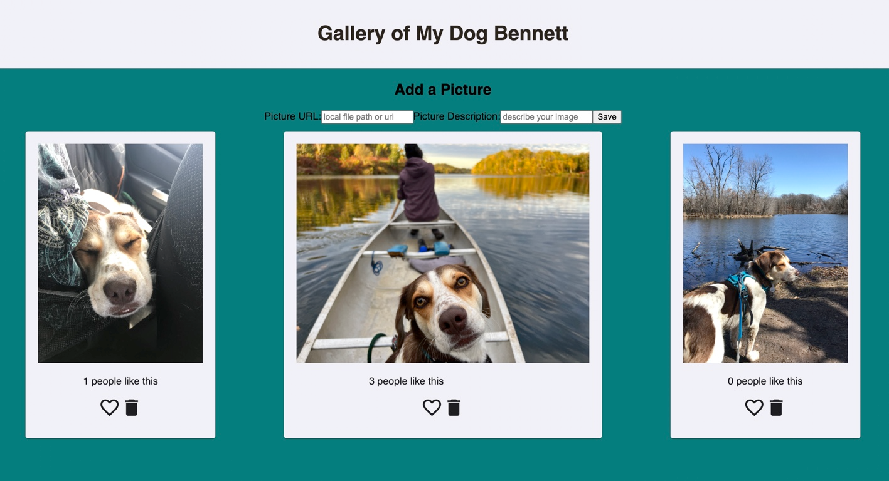

# Gallery of My Dog Bennett

I wanted a place to share pictures of my dog Bennett with my friends and family! 

## Technology

- Postgres SQL and Postico
- React
- Express
- Node
- Material UI (https://mui.com/)

## Installation

1. Make sure Postgres SQL and Postico are installed. Using Postico, create a database named `react-gallery`.
2. Run the queries from `gallery.sql` to set up the database in Postico. 
3. Open your text editor of choice and run an `npm install` in your terminal
4. Run `npm run server` in your terminal
5. Run `npm run client` in your terminal.
6. Upon running `npm run client`, a new browser tab will open for you!

## Usage

Clicking on a picture will flip it over so you can view the text description of the image. Clicking on the text description will flip it back to the picture. Underneath each picture/description, you can see how many people have liked the picture, and you have the option to press heart button to like the picture yourself! Once you've liked an image, the heart button will turn pink, but you can continue to click it and add likes. Pictures can also be deleted using the trashcan icon.

## Known Bugs
You should be able to add images using the form above the gallery. Unfortunately, file paths sourced from the internet are blocked by Cross Origin Resource Policy, so only local files will show. You MUST use absolute file path for images to appear. 

## Technologies 
-Javascript 
-CSS
-HTML

## Acknowledgement
Thanks to Prime Digital Academy who equipped me with the skills to make this application a reality.